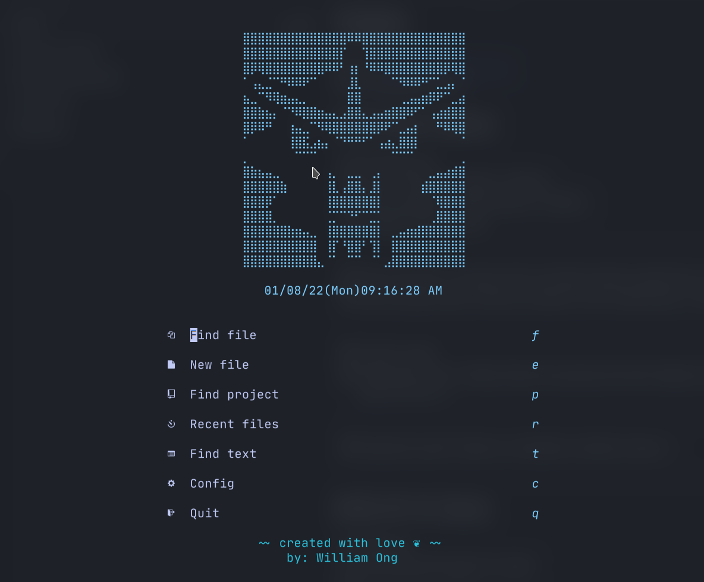
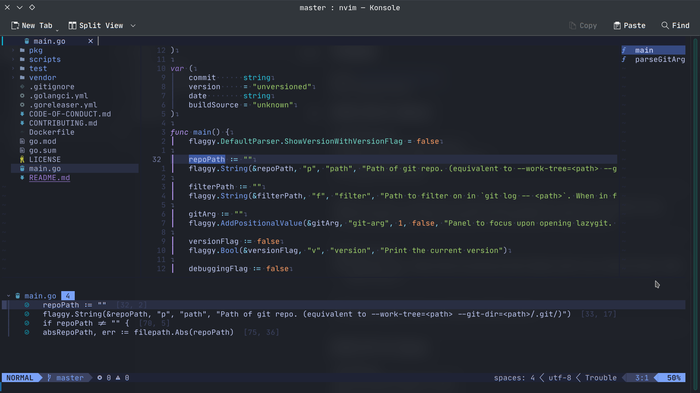

<p align="center"></p>

<p align="center"><b>gyarados.nvim: My Personal Basic Stable IDE</b></p>

<p align="center">
    
    
    
  </p>

## Screenshots




## Motivation

> Why does this configuration exist?

This config attempts to provide a fully working IDE for work & personal use, as I often break the configuration while trying out new plugins.

> Why do you use neovim? Why don't use fully fledge IDE?

Actually, I still use fully fledge IDE for work. But, along the time, I like coding more in vim. It makes you enter a place where you only need to think how to write better code (without all of those annoying GUI). There are times where using fully fledge IDE is much more efficient (like starting an empty project), and there are time where using vim is actually make more sense (like when you need to test some part of code & just need to slightly change the code). Again, different tool for different usecase.

Not gonna lie, when I code for along time every single day, I find it boring (just not enough motivation to write the code). Vim give somewhat give you reward for practicing the art of coding (the more you do it, the faster you are), similar to how you grind a character in a game. It motivate me more, and it make my work become more and more exciting.

Also, most of the feature that I use in IDE (formatting, searching, debugging, editting, refactoring, goto definition, peek docs, etc ...) is provided in neovim :D.

## Prerequisities

Open `nvim` and enter the following:

```
:checkhealth
```

You'll probably notice you don't have support for copy/paste also that python and node haven't been setup

So let's fix that

First we'll fix copy/paste

- On mac `pbcopy` should be builtin

- On Ubuntu

  ```sh
  sudo apt install xsel # for X11
  sudo apt install wl-clipboard # for wayland
  ```

Next we need to install python support (node is optional)

- Neovim python support

  ```sh
  pip install pynvim
  ```

- Neovim node support

  ```sh
  npm i -g neovim
  ```

We will also need `ripgrep` for Telescope to work:

- Ripgrep

  ```sh
  sudo apt install ripgrep
  ```

---

**NOTE** make sure you have [node](https://nodejs.org/en/) installed, I recommend a node manager like [fnm](https://github.com/Schniz/fnm).

## Fonts

I personally like Jetbrains Mono Nerd Font, but the font is not defined in the neovim setting. You should configure it in your terminal settings.

## Configuration

### LSP

To add a new LSP

First Enter:

```
:LspInstallInfo
```

and press `i` on the Language Server you wish to install

Next you will need to add the server to this list: [servers](https://github.com/LunarVim/nvim-basic-ide/blob/8b9ec3bffe8c8577042baf07c75408532a733fea/lua/user/lsp/lsp-installer.lua#L6)

### Formatters and linters

In this neovim configuration, I provided some of the formatters and linters that I personally use:

- Prettier : for javascript and typescript
- Black : for Python
- Stylua : for Lua script
- Goimports : for Golang
- Shfmt : for shell scripts

You can configure new formatters and linters easily in `lua/user/lsp`

## Plugins List

- [packer](https://github.com/wbthomason/packer.nvim)
- [plenary](https://github.com/nvim-lua/plenary.nvim)
- [nvim-autopairs](https://github.com/windwp/nvim-autopairs)
- [Comment.nvim](https://github.com/numToStr/Comment.nvim)
- [nvim-ts-context-commentstring](https://github.com/JoosepAlviste/nvim-ts-context-commentstring)
- [nvim-web-devicons](https://github.com/kyazdani42/nvim-web-devicons)
- [nvim-tree.lua](https://github.com/kyazdani42/nvim-tree.lua)
- [bufferline.nvim](https://github.com/akinsho/bufferline.nvim)
- [vim-bbye](https://github.com/moll/vim-bbye)
- [lualine.nvim](https://github.com/nvim-lualine/lualine.nvim)
- [toggleterm.nvim](https://github.com/akinsho/toggleterm.nvim)
- [project.nvim](https://github.com/ahmedkhalf/project.nvim)
- [impatient.nvim](https://github.com/lewis6991/impatient.nvim)
- [indent-blankline.nvim](https://github.com/lukas-reineke/indent-blankline.nvim)
- [alpha-nvim](https://github.com/goolord/alpha-nvim)
- [tokyonight.nvim](https://github.com/folke/tokyonight.nvim)
- [catppuccin](https://github.com/catppuccin/nvim)
- [nvim-cmp](https://github.com/hrsh7th/nvim-cmp)
- [cmp-buffer](https://github.com/hrsh7th/cmp-buffer)
- [cmp-path](https://github.com/hrsh7th/cmp-path)
- [cmp_luasnip](https://github.com/saadparwaiz1/cmp_luasnip)
- [cmp-nvim-lsp](https://github.com/hrsh7th/cmp-nvim-lsp)
- [cmp-nvim-lua](https://github.com/hrsh7th/cmp-nvim-lua)
- [LuaSnip](https://github.com/L3MON4D3/LuaSnip)
- [friendly-snippets](https://github.com/rafamadriz/friendly-snippets)
- [nvim-lspconfig](https://github.com/neovim/nvim-lspconfig)
- [nvim-lsp-installer](https://github.com/williamboman/nvim-lsp-installer)
- [null-ls.nvim](https://github.com/jose-elias-alvarez/null-ls.nvim)
- [vim-illuminate](https://github.com/RRethy/vim-illuminate)
- [telescope.nvim](https://github.com/nvim-telescope/telescope.nvim)
- [nvim-treesitter](https://github.com/nvim-treesitter/nvim-treesitter)
- [gitsigns.nvim](https://github.com/lewis6991/gitsigns.nvim)
- [git-blame.nvim](https://github.com/f-person/git-blame.nvim)
- [leap.nvim](https://github.com/ggandor/leap.nvim)
- [trouble.nvim](https://github.com/folke/trouble.nvim)
- [nvim-dap](https://github.com/mfussenegger/nvim-dap)
- [nvim-dap-go](https://github.com/leoluz/nvim-dap-go)
- [nvim-dap-python](https://github.com/mfussenegger/nvim-dap-python)
- [telescope-dap](https://github.com/nvim-telescope/telescope-dap.nvim)
- [nvim-dap-ui](https://github.com/rcarriga/nvim-dap-ui)
- [DAPInstall.nvim](https://github.com/ravenxrz/DAPInstall.nvim)
- [barbar.nvim](https://github.com/romgrk/barbar.nvim)
- [refactoring.nvim](https://github.com/ThePrimeagen/refactoring.nvim)
- [fidget.nvim](https://github.com/j-hui/fidget.nvim)
---

## Thanks to...

- [LunarVim](https://github.com/LunarVim/nvim-basic-ide)

## ❤️ Support

If you feel that this repo have helped you provide more example on learning software engineering, then it is enough for me! Wanna contribute more? Please ⭐ this repo so other can see it too!
